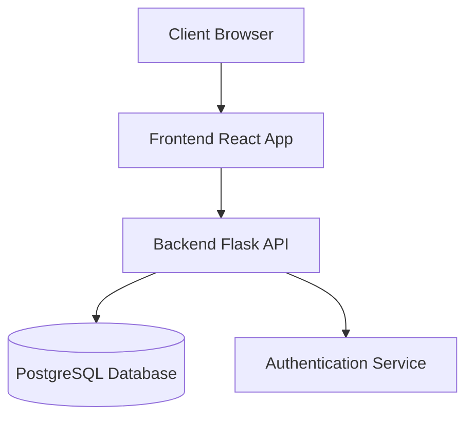

# System Architecture

## Overview

The AI Demo Project is a full-stack web application built with a microservices architecture. The system consists of three main components:

1. Frontend (React Application)
2. Backend API (Flask)
3. Database (PostgreSQL)

## System Components



## Technology Stack

### Frontend
- React 18
- TypeScript
- Ant Design
- React Router
- Axios
- Redux Toolkit

### Backend
- Python 3.9+
- Flask
- SQLAlchemy
- PostgreSQL
- JWT Authentication
- Pydantic
- Alembic

### Infrastructure
- Docker
- Docker Compose
- Nginx
- PostgreSQL

## Database Schema

### Users Table
```sql
CREATE TABLE users (
    id SERIAL PRIMARY KEY,
    username VARCHAR(50) UNIQUE NOT NULL,
    email VARCHAR(255) UNIQUE NOT NULL,
    password_hash VARCHAR(255) NOT NULL,
    is_active BOOLEAN DEFAULT true,
    created_at TIMESTAMP WITH TIME ZONE DEFAULT CURRENT_TIMESTAMP,
    updated_at TIMESTAMP WITH TIME ZONE DEFAULT CURRENT_TIMESTAMP
);
```

## Security

- JWT-based authentication
- Password hashing using bcrypt
- CORS configuration
- Rate limiting
- Input validation
- SQL injection prevention

## Performance Considerations

- Database indexing
- Caching strategy
- API rate limiting
- Frontend optimization
- Load balancing (production)

## Monitoring and Logging

- Application logs
- Database monitoring
- Error tracking
- Performance metrics
- Health checks

## Future Considerations

- Scalability improvements
- Additional security measures
- Performance optimizations
- New features and integrations 